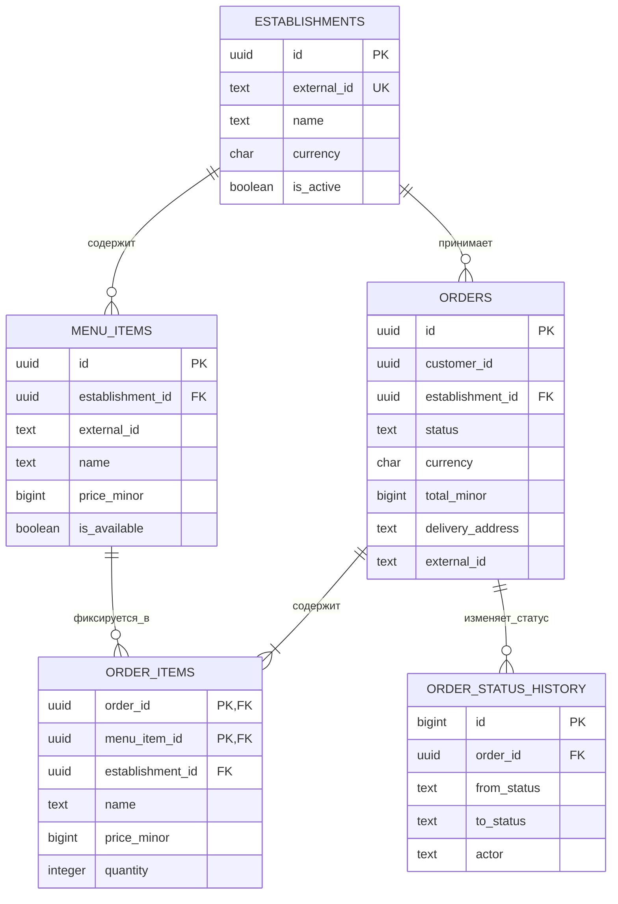

# Схема базы данных

PostgreSQL является владельцем состояния каталога и заказов. Все изменения
схемы оформляются неизменяемыми SQL-файлами в каталоге `migrations`. Runner
сохраняет версию и SHA-256 каждой применённой миграции, выполняет новую миграцию
в транзакции и использует advisory lock против одновременного запуска.

Таблица `idempotency_keys` техническая и не показана на диаграмме: она связывает
область операции и клиентский ключ с хешем запроса и созданным ресурсом.

## Основные решения

- UUID генерируются приложением, что не привязывает API к конкретной базе данных.
- Суммы хранятся как целые числа `price_minor` и `total_minor`; валюта заказа
  фиксируется отдельно.
- `order_items` хранит снимок названия и цены. Изменение или скрытие блюда не
  переписывает историю заказа.
- Составной внешний ключ позиции гарантирует, что блюдо и заказ принадлежат
  одному заведению.
- Удаление заказов бизнес-сценарием не предусмотрено. Каскад нужен только для
  административного удаления ошибочно созданной записи.
